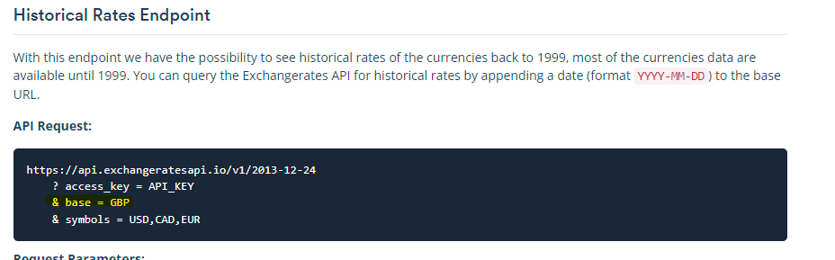
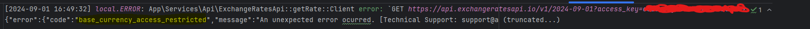
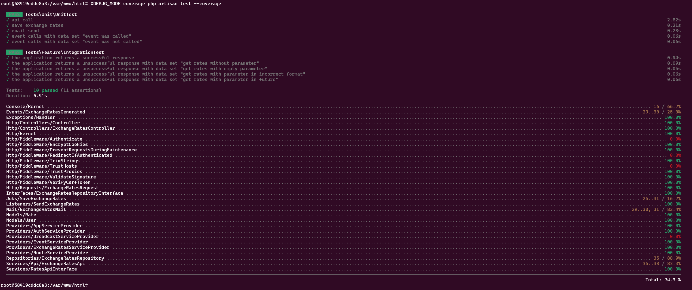

<p align="center"><a href="https://laravel.com" target="_blank"></a></p>

<p align="center">
<a href="https://github.com/laravel/framework/actions"></a>
<a href="https://packagist.org/packages/laravel/framework"></a>
<a href="https://packagist.org/packages/laravel/framework"></a>
<a href="https://packagist.org/packages/laravel/framework"></a>
</p>

## Important

- Used API to get Exchange Rates: https://exchangeratesapi.io/
- Used free account
- Unable change "base":
  - Documentation https://exchangeratesapi.io/documentation/#historicalrates "base" parameter
  
  - Returns error - "Base Currency Access Restricted"
  

## Launching

- Clone repository
- `cd plus-24` - go to project directory
- `./install.sh` or `./start.sh` - run docker containers for project: PHP and MySQL
- `docker ps` - find running PHP container name, f.e.: `plus-24-php-1`
- `docker exec -it plus-24-php-1 bash` - go inside of container
- `cp .env.example .env` - copy environment files
- Set environment variables in `.env``:
  - MAIL_USERNAME=[your_email]
  - MAIL_PASSWORD=[your_email_password]
  - MAIL_FROM_ADDRESS=[your_email]
  - API_KEY=[your_exchange_rates_api_key]
  - API_EMAIL=[your_email_where_send_test_email]
- `composer install`
- `php artisan migrate:fresh`
- `./stop.sh` - to stop containers

## API end-point
- `http://127.0.0.1/api/rate?date=2024-09-01` - IMPORTANT: date - today or below
```
curl --location 'http://127.0.0.1/api/rate?date=2024-09-01' \
--header 'Accept: application/json'
```

## Authentication
- This endpoint doesn't have authentication - rates are available on public resources.
- There is another mine project with authentication - https://github.com/GintarasSSS/cavu

## Response
```
{
    "status": "success",
    "data": {
        "base": "EUR",
        "date": "2024-09-01",
        "rates": {
            "AED": 4.062499,
            "AFN": 78.070516,
            "ALL": 99.675124,
            "AMD": 429.792738,
            "AUD": 1.634753,
            "CAD": 1.492203,
            "CHF": 0.940169,
            "CNY": 7.845486,
            "GBP": 0.84237,
            "JPY": 161.691397
        }
    }
}
```

## Testing
- Inside of PHP container: `XDEBUG_MODE=coverage php artisan test --coverage`

